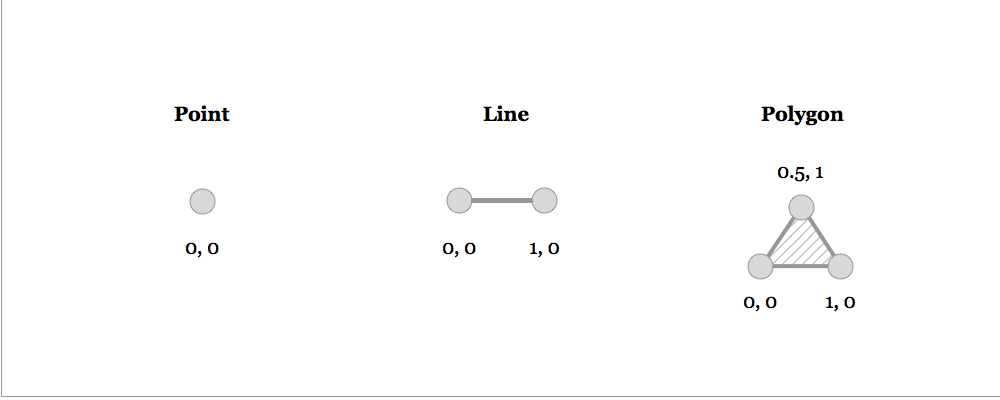
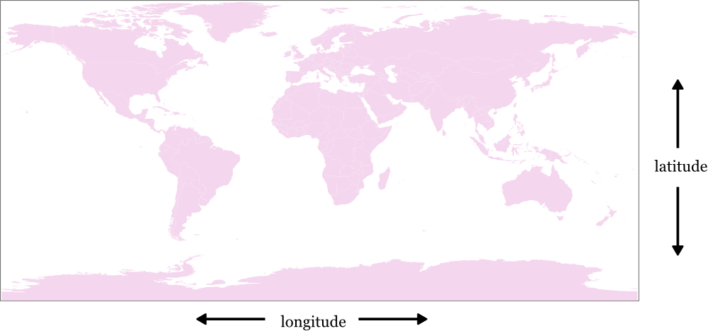

# Data

Fundamentally, geographical data is one of two kinds: **raster**, or **vector**.

## Raster

**Raster** data is like a picture that you'd take with a digital camera: at the lowest level of abstraction, it's a big list of pixels that have values. When you 'zoom in' and look closer at raster data, at some point you'll see these individual pixels, and it will look pixelated.

Raster data is how you'd store pictures of the earth, like the kinds taken from satellites, but that's not all that you would use it for. Pixels don't need to have colors - instead, each pixel can have a number that represents height and the raster data as a whole stores elevation data. Or pixels can store temperature or reflection data and be useful for environmental work.

##### Raster Formats

There are a variety of raster formats that aim to compact data and make it accessible fast for analysis and display. Some of them have parts in common with image formats, like [GeoTIFF](http://trac.osgeo.org/geotiff/) and JPEG2000. Raster data formats are essentially smart ways to pack pixels into a small amount of space, as well as data that specifies the relationship between pixels and places on earth.

## Vector

**Vector** data is more like a PDF or a math equation: instead of pixels, vector data has points and lines defined in math. So zooming in on vector data makes the features larger, but at no point do they become pixellated, since there are no pixels in play here.

Vector data is how you'd store roads, buildings, points of interest, or other things that have some place in the world.

##### Vector Formats

The most established vector format is the [Shapefile](http://en.wikipedia.org/wiki/Shapefile) - a simple, file-based format that awkwardly spreads the necessary data between four separate file - `.shp`, `.prj`, `.shx`, and `.dbf`. Shapefiles are binary data, so opening them in a text editor won't show anything accessible. They're efficient and common, but have limitations - for instance, attribute data in shapefiles can't have field names longer than ten letters.

[GeoJSON](http://geojson.org/) and [TopoJSON](https://github.com/mbostock/topojson) are two newer formats based on [JSON](http://www.json.org/) text encoding. Being text-based, they're simpler to implement in software than Shapefiles - so they've caught on with new web software.

### Topology

Some vector data also keeps track of topology, the relationships between different shapes that touch. For instance, it's common for political borders to precisely touch - you can stand with one foot in Arizona and another in New Mexico. A lot of geospatial data, though, will have one shape that represents Arizona and another that represents New Mexico, with two borders that precisely overlap, but have no other association.

This gets tricky when you want to do something like ask 'which states touch?' or simplify the shapes of objects while preserving borders lined up. Thus topology is introduced: some vector data, instead of storing a shape of Arizona and another of New Mexico, saves a bunch of lines and keeps track of which ones form the boundary of which object. So, the border between Arizona and New Mexico is a single line that's used to draw the border of both states, and if you have the line, it changes the shape of both states.

## Geocoding

A great deal of geographic data is none of the above - instead of being composed of the numbers that computers fancy, we have spreadsheets with text data or tweets with references to places, streets, addresses, and so on.

Unfortunately, you can't just put this data on a map - the words "United States' mean many different things, like a centroid of the continental US, or polygon boundaries of all states plus Alaska, DC, and Hawaii, or even a box containing all of the above. Thus it's a rough translation we call 'geocoding' that turns rough text descriptions into data we can directly use - usually vector data.

Reverse geocoding works just as you might guess. Have you ever wondered how mobile applications turn your current location into into an address for a driver or delivery-person? That's reverse geocoding: your phone knows its exact coordinate position (vector data) via the GPS, and that location is reverse geocoded to an address.

Both geocoding and reverse geocoding can be very tricky problems to solve. Coordinate position errors, poorly formatted address data, and an ever-changing grid of streets and buildings all contribute to the difficulty in turning addresses into vectors, or vice versa.

## Data Collection

Map data has been collected in countless ways through the years - everything from sailors logs to twitter creates data. Currently, there are a few major sources that merit discussion:

**GPS**, the satellite constellation that gives your cell phone a blue dot on the map, is the foundation of collecting accurate vector data. Surveyors will drive with highly accurate GPS units and combine their results into something trustworthy.

A number of observational **satellites and airplanes** collect the majority of the raster data we have today, constantly taking photos from different altitudes and combining them into something that looks a little like a picture of the world. The same sensors also capture what we call 'non-visible spectrums', like infrared light, that's useful for mapping agriculture. Some tricked-out rigs include [LiDAR](http://en.wikipedia.org/wiki/Lidar), a kind of laser sensor that measures altitude and yields us raster altitude data.

**Corporations, governments, and communities** maintain different world maps of varying detail. For instance, both Google and [OpenStreetMap](http://www.openstreetmap.org/) focus on mapping all roads and details about them, and sources like the [CIA World Factbook](https://www.cia.gov/library/publications/the-world-factbook/) and [Natural Earth](http://www.naturalearthdata.com/) keep track of political borders.

### Storage

There are many ways to store geographic data. Data can be stored as printouts, but recently it's more popular to store it in a way easily accessed and shared, digitally.

There are many different filetypes and conventions for storing geographical data, and thus a variety of tools to translate between different representations. Data is stored in databases or in individual files, but the practical difference between the two is not necessarily important.

# Information

What is a map, graphically

## Datum

A geographic datum is a specific way of measuring places on earth. Back in the day, this was a hard problem, since surveyors would require a very high level of accuracy for specific areas: measurements down to the inch for a town. And so, instead of just saying latitude, longitude, we'd say "meters from this spot measured North/South."

Practicing cartographers don't need to know much about the internal operations of datums anymore, since it's handled in software and most special formats can be automatically translated. A global standard called WGS84 caught on for general-purpose mapping and is the recommended way to store data.

Though you don't often need to know the details of transforming between datums, when working with geo data from different sources it is *very* important that you confirm that the datums match. Working with data in different map datums can result in non-trivial errors, particularly at small scales on the order of 0-200m.

## Latitude & Longitude

The most common way to store places on earth is with latitude and longitude values. Historically latitude and longitude are sometimes represented in sexagesimal notation, like `38° 32'`, but the new standard is to represent them as simple numbers, like `38.2`, that are easy for computers to understand.

**Latitude** values range from -90 at the South Pole to 90 at the North Pole. All along the equator the latitude value is 0.

**Longitude** start at 0 at the Prime Meridian which cuts through Africa and Greenwich, and extend to -180 and 180 at the antemeridian.

The combination of latitude and longitude is usually called a coordinate, and can be represented as 'latitude, longitude', or 'longitude, latitude': historically, the former was standard, but 'longitude, latitude' has recently gained popularity because it mirrors the 'X, Y' ordering of coordinates in math's euclidean space.

Sometimes more than just the latitude, longitude position is recorded as data: altitude can also be included, as well as time of capture and other factors. In the case of including altitude, it's usually stored as a third coordinate, like 'longitude, latitude, altitude.'

## Projection

Projections are what we call the mathematical equations that do the trick of turning the world, which is a sphere, into some flat shape that fits on a printout or a computer screen. It's a messy task to do, this transformation - there's no way to smoosh the world onto a screen without distorting it in some way. You either lose direction, or relative size, or come out with something very weird looking.

## Symbolization

Symbolization is a fancy word for the particular ways that data is transformed into graphics in the world of maps.

Fundamentally, data doesn't look like anything: a list of pixel values or road lines is just as well represented in a spreadsheet or a chart as it is on a map. Thus to 'convert' isn't the right word for what we do with data: at the most basic level, everything is a decision.

Symbolic techniques include anything representable in graphics or even 3D, so let's only look at a few:

## Sequential & Categorical

Symbolization tends to highlight two different characteristics of data: the sequential and categorical.

### Choropleth

Choropleth maps preserve the existing boundaries and shapes of places and represent data by changing their colors, patterns or textures. A familiar example of this kind of map is in election results or demographic makeup, in which data is percentage values for some fixed piece of land - a value per voting precinct or census area.

Choropleth maps are a natural fit for data like rates, densities, or percentages. They aren't recommended for absolute values: since they keep the area of shapes the same, they tend to over-emphasize large features. Also, since choropleth maps rely on color differences to represent information, it's very important that the colors are well-chosen to be colorblind-safe, understandable, and consistent.

##### Choropleths in Depth

The selection of colors in a choropleth map is generally called the 'palette' or the 'color ramp', especially when the colors are sequential. [ColorBrewer](http://colorbrewer2.org/) is a well-researched set of colors that are understandable and clear.

### Point

Point maps are a better alternative for absolute values - the only geometry that they preserve is a single point per feature.

The specific point or marker used in this style varies tremendously - some maps scale text itself, or circles or squares.

## Publishing

## Analysis

Raster & vector analysis as aggregation & transformation

### Vector to Raster

It's possible to move between the two types of map data, as disparate as they might seem, and it's actually quite common: it's just not direct.

Typically vector data always becomes raster - what we call 'rasterized' or 'rendered' when it is displayed: computer screens and printers operate on the level of pixels, not lines or shapes. This conversion is imperfect: remember that vector data is not pixel-based, so you can never zoom in and see fuzzy features. Thus, generally, when vector data is converted into a raster format, you can't transform that raster representation back into exactly the source.

Sometimes we convert vector data to raster ahead of time - in order to run some kinds of analysis, it's easier to do the math on a pixel basis.

### Raster to Vector

Likewise, raster data can be vectorized in a number of ways. On raster satellite images of the earth, people draw, or 'trace', lines for streets, points for houses, or polygons for buildings. This lets us have a version of the data upon which we can do more things - you can figure out driving routes from vector data of streets, but can't do that with a satellite image of streets.

### Simulation

With geographic data, it's possible to simulate certain natural processes, and this simulation is a big part of what working mappers do. Given elevation data for a mountain range, it's possible to simulate highlights and shadows for those mountains in light, in a process called hillshading.

More complex processes are also possible, like determining where water will collect after rainfall, in a process called a watershed, or determining everywhere on the map that will be viewable if you're standing at a mountaintop, called a 'viewshed'.

### Aggregation

The most common form of aggregation is the idea of a sum - given a large group of numbers, you can add them together to get an idea of them all at once. For instance, the GDP of a country is more immediately informative than simply listing every individual contribution to an economy.

Aggregation in maps is similarly used. Given granular data, like millions of individual household incomes, you can use mapping algorithms to sum or average the values inside of specific areas of the world, to show average income per town or city.

Aggregation is also used along with a technique called **binning**: given many discrete points, you can draw arbitrary shapes on the map, like squares or hexagons, and total all of the points that fall in each shape. That way, instead of having millions of tiny points that are difficult to grasp at a glance, you can style the map as a choropleth.

### Interpolation

Whereas aggregation takes lots of data and distills it into something simpler to analyze and visualize, interpolation 'fills in the blanks' between values. Interpolation is often used for datasets like elevation, where you have raster data values that records the height of every inch of a mountain, but there are a few places missing from the data - what programmers call `null` values.

Interpolation looks at the values around the 'blanks' and assumes that the missing values are basically similar to what's around them - a missing pixel at the top of a mountain will be assumed to be pretty high, while one in a valley is assumed to be low.

Interpolation can happen on a vector data level as well, through the Voronoi algorithm, that takes a set of points and turns them into polygons of all of the area around them.

## Conceptual review

The unity of data

Edges blending into math and art

### License

[Creative Commons Attribution 3.0 Unported](http://creativecommons.org/licenses/by/3.0/us/)
