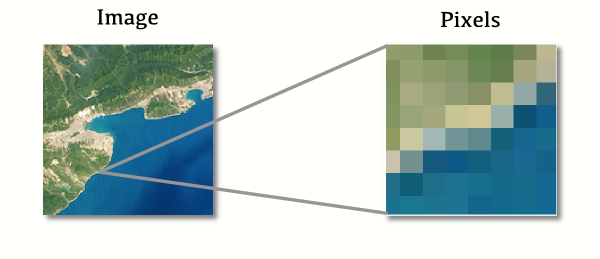
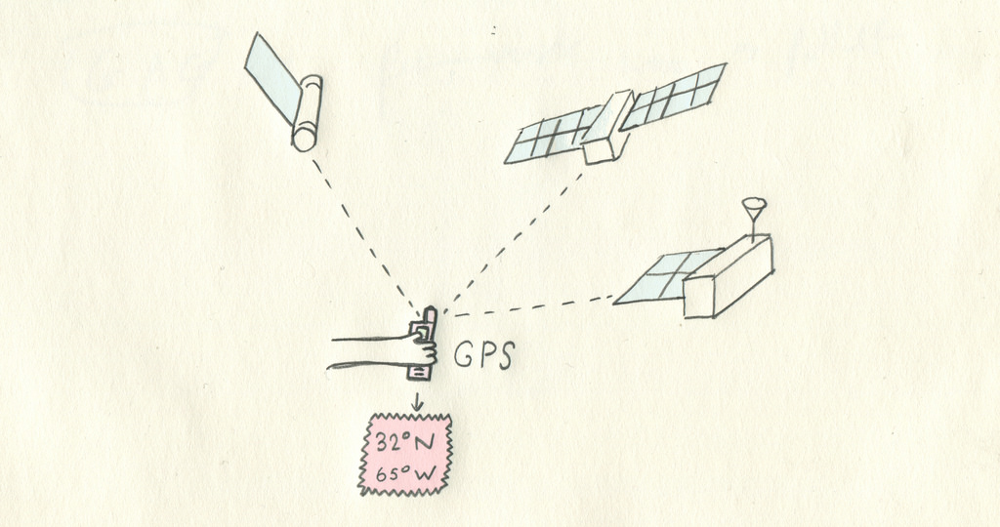
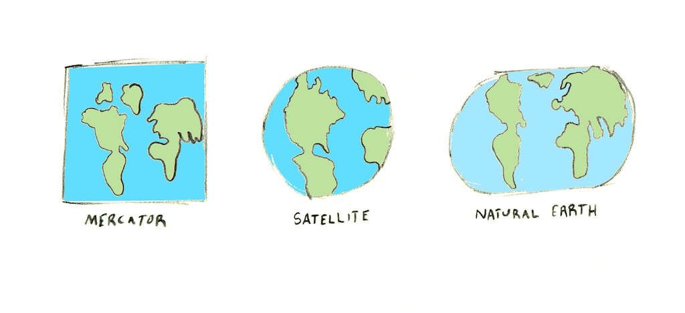
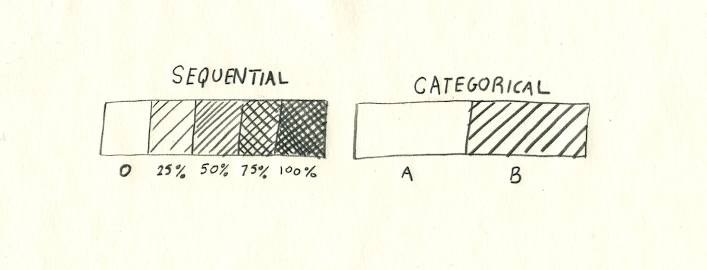
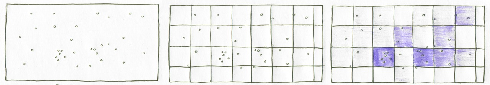

# map school

Qu'est-ce qu'une carte ? Jusqu'aux années 1980, les cartes étaient dessinées à la main, avec minutie et attention. Aujourd'hui presque systématiquement créées à l'aide d'un ordinateur, les cartes sont monnaie courante, et présentes dans des domaines aussi différents que les indications d'itinéraires, les visualisations, ou les conflits politiques de frontières. Mais posons un regard plus approfondi sur les éléments de base d'une carte, depuis le point de vue de son créateur. 

Les cartes réalisées par ordinateur sont essentiellement constituées de données. Une donnée peut être composée de milliards de points, de quelques polygones, ou d'un enregistrement photographique de couleurs et de températures. Il est important de noter qu'une donnée n'est pas spécifique à un seul usage.

De ces données, nous faisons des chiffres, des images, des décisions. Le plus souvent, nous en faisons des images, dans un processus nommé « symbolisation » par lequel nous décidons quelques éléments visuels vont représenter quelle partie d'un jeu de données. Nous analysons les données, c'est-à-dire que nous les transformons, agrégeons et résumons pour apporter différentes réponses et représenter différents aspects de la connaissance. Les deux tâches de la symbolisation et de l'analyse sont souvent combinées, la symbolisation formant les limites de ce qu'on peut représenter et l'analyse définissant les aspects de la donnée sur laquelle se concentrer.

# Données

En général, les données géographiques sont soit des **raster** (données matricielle), soit des **vecteurs** – composées soit de pixels, soit d'information géométrique. Les deux types de données sont souvent combinées, par exemple lorsque une donnée routière vectorielle est superposée à une donnée satellite raster.

## Raster

Les données **raster** sont comme une photo prise avec un appareil photo numérique : au plus bas niveau d'abstraction, c'est une liste de pixels avec des valeurs. Si l'on zoome pour regarder le raster de plus près, au bout d'un moment, ces pixels discrets apparaissent – l'image devient « pixellisée ».

Les données raster sont utilisées pour les photographies de la Terre, comme celles prises par des satellites – mais ce n'est qu'un exemple. Les pixels ne sont pas forcément colorés : alternativement, chaque pixel peut avoir un numéro qui représente la hauteur, et la donnée raster dans son ensemble stocke alors une donnée d'élévation. Les pixels peuvent aussi stocker des températures, ou des données relatives à la réverbération, et être utiles pour travailler sur l'environnement.

##### Bandes raster

Les pixel des données raster ne sont donc pas forcément des couleurs pleines : on appelle son contenu des bandes. Une image normale a trois bandes habituelles : rouge, vert et bleu. Combinées, ces bandes font une image avec laquelle nous sommes familiers. Certaines données raster ont moins de bandes - une seule dans le cas d'une donnée d'élévation – et certaines peuvent en avoir beaucoup plus – pas uniquement des couleurs visibles, mais des longueurs d'onde invisible à l'oeil nu, comme l'infrarouge ou l'ultraviolet. Quand une donnée raster est analysée et affichée, on peut combiner les bandes ou n'afficher que celles que l'on souhaite pour un usage donnée.

##### Les formats raster

Les formats raster ont pour objectif de compacter les données et de les rendre accessibles pour l'analyse et l'affichage. Certains d'entre eux sont des formats d'image habituels, mais avec une composante spatiale, comme le [GeoTIFF](http://fr.wikipedia.org/wiki/GeoTIFF) ou le JPEG2000.

 « Sous le capot », les formats de données raster gèrent deux tâches différentes : intégrer la donnée dans des pixels, et garder en mémoire la relation entre ces pixels et des lieux réels sur la planète – c'est « l'emprise » de la donnée.

## Vecteur

La donnée **vecteur** stocke des géométries basiques plutôt que des données pixels. Peu importe le niveau de zoom, les pixels n'apparaîtront pas : la donnée stockée est composée de points et de lignes géométriques, converties en images uniquement lorsque nécessaire. 

Les données vecteurs sont utilisées pour stocker des informations sur les routes, les bâtiments ou les points d'intérêt, entre autres éléments géographiques.

##### Les formats vecteur

Le format vecteur le plus établi est le [shapefile](http://fr.wikipedia.org/wiki/Shapefile), un format simple, de type « fichier », qui divise un peu maladroitement la donnée en quatre fichiers distincts : `.shp` (où la donnée géométrique est stockée), `.prj` (une chaîne de caractères décrivant la projection utilisée), `.shx` (un index permettant d'accélérer les recherches), et `.dbf` (une base de données comprenant toute la donnée associée à la géométrie du fichier `.shp`). La plupart de ces fichiers sont des données binaires : les ouvrir dans un éditeur de texte ne révèlera rien d'accessible, excepté le fichier `.prj`, qui définit la projection en texte simple. La base de données `.dbf` peut être lue avec LibreOffice Calc car son format dérive d'une vieille spécification relative aux base de données. Néanmoins, cette spécification limite le nombre de données attributaires qu'on peut stocker dans un shapefile. Par exemple, la taille d'un fichier `.dbf` ne peut pas dépasser 2 Go, les noms de champs ne peuvent contenir d'espace et ne peuvent excéder 10 caractères, les valeurs nulles (pas d'information) ou l'essentiel des caractères spéciaux ne sont pas pris en charge, [etc.](http://en.wikipedia.org/wiki/Shapefile#Limitations). 

[GeoJSON](http://geojson.org/), [TopoJSON](https://github.com/mbostock/topojson) et [KML](http://developers.google.com/kml) sont des formats plus récents basés respectivement sur les encodages de texte [JSON](http://www.json.org/) et [XML](http://fr.wikipedia.org/wiki/XML). Étant basés sur du texte, ils sont plus faciles à implémenter dans des logiciels que les shapefiles, et combinés avec une flexibilité et des fonctionnalités additionnelles, ils sont devenus les standards des logiciels webs les plus récents. L'inconvénient du GeoJSON est qu'il existe moins d'outils construits pour comparer chaque enregistrement, donc le nettoyage ou l'analyse des données peuvent être une peu délicats.

### Topologie

En plus de stocker des lieux et des formes, certains fichiers vecteurs gardent en mémoire la topologie, c'est-à-dire la relation entre différentes formes. Par exemple, les frontières politiques se touchent généralement – il est théoriquement possible d'avoir un pied en France et l'autre en Italie. Pourtant, beaucoup de données géospatiales vont avoir une forme pour représenter la France et  l'autre pour représenter l'Italie, avec deux frontières qui se chevauchent exactement, mais n'ont pas d'autre lien.

Les choses se compliquent si l'on se pose une question du type « quels États se touchent ? » ou simplifier la forme des objets tout en préservant l'alignement des frontières. On utilise le concept de topologie : certains fichiers vecteurs, au lieu de stocker une forme pour la France et l'autre pour l'Italie, vont enregistrer un ensemble de lignes et garder la mémoire de laquelle constitue la frontière de telle forme. La frontière entre la France et l'Italie est donc une ligne simple utilisée pour dessiner la frontière des deux États, et si l'on modifie cette ligne, la forme des deux États change. 

## Géocodage

Certaines données géographiques ne sont ni vectorielles ni matricielles : au lieu d'être constituées de chiffres que l'ordinateur comprend, l'information est stockée au format texte, et peut inclure des références aux toponymes, rues, adresses, ou à d'autres moyens d'identification.

Il est malheureusement impossible d'afficher simplement cette donnée sur une carte. Un procédé indirect, et souvent inapproprié, est mis en œuvre pour transformer des mots comme « États-Unis » en des points comme -120, 40. Ce procédé est appelé le **géocodage**. Il met en relation des bases de données toponymiques (noms de rues, de pays ou autres) et des localisations géographiques à l'aide d'algorithmes qui tentent de trouver les plus proches correspondances à des requêtes imprécises.

### Géocodage inversé

Le procédé inverse s'appelle logiquement le **géocodage inversé**. Il transforme des données géographiques comme des points en texte lisible par l'être humain, comme `États-Unis` ou `1714 14th street`. Comme le géocodage, le géocodage inversé est approximatif – un lieu sur la planète peut être situé à l'intérieur de frontières qui se chevauchent ou sujettes à conflit, ou encore être entre deux points d'adresse.

Le géocodage et le géocodage inversé sont difficiles à mettre en œuvre : les erreurs de position de coordonnées, les données d'adresses mal formatées et des réseaux de routes ou de bâtiments en changement constant participent entre autres à la difficulté de transformer des adresses en coordonnées, ou vice versa.

<a class='further-reading' href='/geocoding.html'>Pour en savoir plus sur le géocodage</a>

## Collecter des données

Les données cartographiques ont été collectées de mille manières différentes à travers le temps – depuis les données de navigation marine jusqu'aux tweets géocodés. Actuellement quelques sources majeures méritent d'être présentées :

Le **GPS**, une constellation de satellites qui permettent de mettre un point bleu sur la carte de votre smartphone, est à la base de la récolte de données vecteurs précises. Les relevés de terrain menés avec des GPS de plus en plus précis permettent de créer des données de plus en plus fiables.

Les **satellites et les avions** d'observation collectent l'essentiel des données raster dont nous disposons aujourd'hui, en prenant des photos en permanence depuis différentes altitudes et en les combinant pour créer ce qui ressemble à une image du monde. Les mêmes capteurs enregistrent ce que nous appelons le « spectre non-visible », comme la lumière infrarouge, utile pour cartographier des cultures agricoles ou la déforestation. Des équipements améliorés peuvent aussi inclure le [LiDAR](http://fr.wikipedia.org/wiki/Lidar), un type de capteur laser qui mesure l'altitude et renvoie des raster d'altitude.

Les **entreprises, gouvernements et communautés d'intérêts** tiennent à jour différentes cartes du monde aux niveaux de détails variables. Par exemple [Google](http://maps.google.com) et [OpenStreetMap](http://www.openstreetmap.org/) se focalisent sur la cartographie des routes et des détails les concernant, et des sources comme le [CIA World Factbook](https://www.cia.gov/library/publications/the-world-factbook/) et [Natural Earth](http://www.naturalearthdata.com/) se concentrent sur les frontières politiques.

### Stockage

Il existe de nombreuses manières de stocker des données géographiques. Elles peuvent être stockées sous forme imprimée, mais depuis quelques temps, il est plus fréquent de les stocker sous forme numérique, facilement accessible et partageable.

Les types de fichiers et les conventions de stockage peuvent être très différents, comme le sont en conséquence les différents outils de conversion entre différentes représentations. La donnée est stockée dans des bases de données ou dans des fichiers individuels, mais la différence pratique entre les deux n'est pas forcément importante. 

# Information 

Une carte est une information visualisée : au tout départ se trouvent les questions des datums, des chiffres et du stockage – les rouages essentiels de l'enregistrement et de la différentiation des différents endroits sur Terre. Entre les données et la visualisation, il existe une transformation appelée « projection », à travers laquelle des lieux de la planète deviennent les lieux d'une surface plane, comme une impression ou un écran d'ordinateur. À la toute fin se fait le choix des couleurs, de la tonalité, et d'une symbolisation qui puisse traduire des détails issus des données en images faciles à comprendre et à interpréter par tout le monde.

## Latitude & longitude

La manière la plus comune de stocker des lieux de la planète est en utilisant des valeurs de latitude et de longitude. Historiquement, ces dernières peuvent être représentées en notation sexagésimale, comme `38° 12'`, mais le standard plus récent est de les représenter comme de simples chiffres, comme `38.2`, facile à comprendre pour les ordinateurs. 

La **latitude** s'étend de -90 au Pôle Sud à 90 au Pôle Nord. La latitude au niveau de l'équateur est de 0. 

La **longitude** s'étende de -180 à 180, et la ligne ou ces valeurs se rencontrent, qui traverse le Pacifique du nord au sud, est appelée l'antiméridien. La valeur 0 est définie comme le premier méridien et traverse l'Afrique et l'Europe (notamment au niveau de l'Observatoire Royal, à Greenwich, Londres).

La combinaison d'une latitude et d'une longitude est habituellement appelée une coordonnée, et peut être représentée de deux manières : 'latitude,longitude' ou 'longitude,latitude'. Historiquement, la première était le standard, mais plus récemment, la notation 'longitude,latitude' a gagné de la popularité, car elle renvoie à l'ordre 'X,Y' des coordonnées dans un espace mathématique euclidien.

L'ordre des coordonnées peut créer de la confusion, notamment parce que les logiciels de cartographie basés sur des navigateurs attendent en général 'latitude,longitude', quand bien même beaucoup de protocoles de communication soient basés sur 'longitude,latitude'.

Parfois, des informations supplémentaires à la latitude ou la longitude sont enregistrées comme données : l'altitude peut être incluse également, tout comme le moment de l'enregistrement ou d'autres facteurs. Lorsque l'altitude est incluse, elle est généralement stockée comme une troisième coordonnée, comme 'longitude,latitude,altitude'.

## La forme de la Terre

Stocker et représenter le monde nous amène à la question de sa forme – la latitude et la longitude peuvent-elles être cartographiées sur une sphère parfaite et conserver leur justesse spatiale ?

La Terre est un objet en rotation, et ses composants peuvent changer de forme. Elle est donc bombée au centre et ressemble à un [sphéroïde aplati](http://fr.wikipedia.org/wiki/Sphéroïde) plutôt qu'à une sphère pure. E si l'on se rapproche, ce n'est même pas tout à fait juste : la Terre est recouverte de [différences d'élévation](http://fr.wikipedia.org/wiki/Topographie) comme les montagnes ou les vallées, et même de reliefs artificialisés comme des villes.

Au quotidien, nous utilisons différentes estimations de sa forme : des standards comme le [WGS84](http://fr.wikipedia.org/wiki/WGS_84) définissent des valeurs précises pour la longueur des deux axes de la planète, et l'on peut ainsi effectuer des calculs depuis un [ellipsoïde](http://fr.wikipedia.org/wiki/Ellipsoïde) de référence plutôt que depuis une sphère. Pour des besoins de mesures à très grande échelle ou dans le cas de certaines applications scientifiques nécessitant des valeurs de surface précises, on peut aussi utiliser des modèles de [géoïdes](http://fr.wikipedia.org/wiki/Géoïde), qui sont des calculs en trois dimensions de la hauteur théorique des océans. 

Cette branche des sciences de la Terre, appelée [géodésie](http://fr.wikipedia.org/wiki/Géodésie), est en redéfinition permanente depuis que l'on est en mesure de modéliser et de mesurer rapidement les mouvements terrestres et ses changements de formes.

## Projection

Les projections sont ce que nous appelons les équations mathématiques qui permettent de transformer le monde en une surface plane qui tienne dans une impression ou sur un écran. Cette transformation est loin d'être aisée à mener – il n'existe pas de moyen de faire tenir le monde dans un écran sans le déformer d'une manière ou d'une autre. On perd soit l'orientation, soit la taille relative, et on se retrouve avec une forme qui peut être très étrange.

<a class='further-reading' href='/datum.html'>Pour en savoir plus sur les datums</a>

## Symbolisation 

En cartographie, la symbolisation est un mot un peu fantaisiste pour décrire les différentes manières par lesquelles la donnée est transformée en une représentation graphique. 

Les données n'ont pas d'apparence graphique en elles-mêmes : une liste de valeurs de pixels ou de lignes routières est tout aussi bien représentée dans un tableur que dans un tableau ou une carte. Parler de « transformation » graphique n'est donc pas très approprié pour décrire ce que nous faisons avec les données : il s'agit plutôt de décider de son rendu graphique. 

Les techniques symboliques incluent tout ce qui est représentable, qu'il s'agisse de graphisme ou de 3D, nous n'en couvrerons donc que quelques-unes :

## Représentation séquentielle et catégorielle 

La symbolisation a tendance à mettre en avant deux types différentes de données : les données séquentielles et les données catégorielles. Les donnée séquentielles, appelées aussi continues ou quantitatives, comprennent en général des valeurs en chiffres dans une amplitude donnée, comme une graduation entre 0 et 100, ou une donnée d'élévation. Les données catégorielles, discrètes ou qualitatives, sont quant à elles des valeurs isolées – comme 'vrai', 'faux', 'socialiste' ou 'libéraliste'.

Cette division entre les données est l'un des enjeux essentiels de la symbolisation – une source de données séquentielle peut être représentée avec une carte de cercles proportionnels ou un gradient de couleur sur un raster, alors que les données catégorielles sont généralement affichées en utilisant des symboles multiples comme marqueurs, ou un remplissage par couleurs discrètes.

### Représentation choroplèthe 

Les cartes choroplèthes préservent les frontières existantes et la formes des lieux actuels et représentent les données en changeant de couleur, de motif ou de texture. On retrouve ce type de carte pour illustrer des résultats d'élection, ou des thématiques liées à la population – les données sont alors des valeurs en pourcentage pour un territoire donné, des secteurs électoraux par exemple.

Les cartes choroplèthes sont naturellement adaptées pour des données comme des taux, des densités ou des pourcentages. Elles ne sont en revanche pas recommandées pour des valeurs absolues : comme elles conservent la superficie des surfaces, elles ont tendance à donner plus d'importance aux éléments les plus grands. De plus, sachant qu'elles utilisent différentes couleurs pour représenter l'information, il est important de choisir des couleurs compréhensibles, cohérentes, et de
prendre en compte le daltonisme.

<a class='further-reading' href='/colors.html'>Pour en savoir plus sur les couleurs</a>

### Cartes de points

Les cartes de points sont la meilleure alternative pour des valeurs absolues – la seule géométrie qu'elles préservent est un point unique pour chaque valeur.

Le point ou le marqueur spécifique utilisé peut varier énormément – colorer les points sur la base de leurs valeurs séquentielles ou catégorielles peut être utile, mais les points peuvent aussi prendre différentes tailles pour montrer leurs différentes valeurs. Ces symboles à taille variable peuvent être n'importe quelle forme ou image, comme des cercles, des carrés, ou des images de ce qu'ils représentent. Au cas où plusieurs valeurs différentes s'accumulent sur un même point, des camemberts peuvent expliquer parfaitement une donnée qui serait autrement très compliquée à lire.

Il faut prendre garde à ne pas montrer trop de points à la fois, ce qui donnerait une carte difficile à lire. Au cas où il y ait trop de point, une carte choroplèthe avec des valeurs agrégées depuis les points peut être une bonne alternative. Une autre alternative est d'utiliser le clustering, où les points sont regroupés jusqu'à un niveau de zoom permettant une lecture claire.

## Publication

## Analyse

Analyse raster et vecteur : agrégation et transformation

### Du vecteur au raster

Aussi différents que ces deux types de données puissent paraître, il est possible de passer du vecteur au raster et inversement, et il est même relativement fréquent de le faire. Il s'agit simplement d'une procédure indirecte. 

Par exemple, les données vecteurs deviennent des raster – on dit qu'elles sont « rasterizées » ou « rendues » – lorsqu'on les affiche : les écrans d'ordinateur utilisent des pixels, pas des lignes ou des formes. Cette conversion est imparfaite : n'oublions pas que les vecteurs n'étant pas basés sur des pixels, le fait de zoomer au maximum ne fait pas apparaître pour autant d'éléments flous. Ainsi, lorsqu'une donnée vecteur est transformée en raster, il est impossible de transformer ce dernier en vecteur à nouveau et de retrouver la donnée originelle.

Il arrive parfois que l'on transforme une donnée vecteur en donnée raster pour des question de temps – il est plus facile d'effectuer certaines analyses sur un fichier raster. 

### Du raster au vecteur 

De la même manière, une donnée raster peut être vectorisée de différentes manières. Sur les images satellites de la planète, on peut dessiner ou « tracer » des lignes pour les routes, des points pour les maisons, ou des polygones pour les bâtiments. Ça nous permet d'avoir une version de la donnée avec laquelle nous ferons plus de choses – calculer un itinéraire est possible avec une donnée routière vectorielle, pas avec une image satellite. 

### Simulation

Avec des données géographiques, nous pouvons simuler certains processus naturels, et cette simulation est une grande partie du travail du cartographe. En se basant sur des données d'élévation pour une chaîne de montagne, il est possible de simuler le rayonnement solaire et l'ombre projetée de ces montagnes, avec un procédé qu'on appelle « hillshading » (ombrage). 

Des processus plus complexes sont aussi possibles, comme de déterminer le bassin-versant (aire délimitée par les lignes de partage des eaux, et dans laquelle toute la pluie tombée alimente le même exutoire) ou de déterminer les parties de la carte visibles depuis le sommet d'une montagne (le « viewshed » en anglais). 

### Agrégation

La forme d'agrégation la plus commune est la somme : on additionne les chiffres d'un groupe pour n'en obtenir qu'un. Par exemple, le PIB d'un pays est une information plus directe que la liste de chaque contribution individuelle à l'économie du pays.

L'agrégation est utilisée d'une manière similaire en cartographie. À partir d'un jeu de données à très haut niveau de détail, comme les revenus des ménages, on peut utiliser des algorithmes cartographiques pour obtenir la somme ou la moyenne des valeurs situées dans un secteur spécifique, ou pour montrer le revenu moyen des ménages par ville.

L'agrégation est aussi utilisée en parallèle avec une technique appelée le « **binning** » : si l'on travaille avec une série de points, le binning consiste à créer des formes arbitraires sur la cartes, comme des carrés ou des hexagones, à comptabiliser les points présents dans chaque forme et à symboliser les données comme on le ferait pour une carte choroplèthe, évitant ainsi d'avoir des millions de petits points illisibles.

### Interpolation

Là où l'agrégation distille une grande quantité de données en une information plus simple à analyser et à visualiser, l'interpolation « remplit les blancs » entre les valeurs. L'interpolation est souvent utilisée pour des jeux de données comme l'élévation : par exemple, un raster contient des valeurs sur la hauteur de chaque mètre d'une montagne, mais quelques endroits ne sont pas renseignés, ou avec ce que les programmeurs appellent des valeurs `null`. 

L'interpolation observe les valeurs présentes autour du « blanc », et considère que les valeurs manquantes sont relativement similaires à ce qui les entoure – un pixel manquant au sommet d'une montagne sera considéré comme étant relativement élevé, alors qu'un autre dans une vallée sera considéré comme étant relativement bas.

Il y a de nombreuses manières d'interpoler des données ponctuelles :

- Les **cartes de chaleur** assignent une valeur à chaque point et représentent la densité des valeurs ponctuelles en couleurs à « chaleur croissante ».
- Les **courbes de niveaux** se basent sur des échantillons de données ponctuelles, autour desquelles des lignes sont tracées qui représentent une valeur estimée continue. Les cartes d'élévation utilisent souvent cette technique. 
- Un *TIN* (« Triangulated Irregular Network » pour Réseau Irrégulier de Triangles) dessine des triangles entre les points qui peuvent être utilisés pour visualiser un relief. 
- Un *diagramme de Voronoi* transforme un ensemble de points en polygones comprenant toute la surface qui entoure chacun d'entre eux.

## En conclusion

Nous espérons que cette lecture vous aura éclairé et inspiré : c'est un champ qui reste à explorer, avec beaucoup de potentiel et autant de questions sans réponses. La cartographie est un sujet aux connexions multiples, qui touche à l'art, aux mathématiques, à la physique, à l'écologie ou à bien d'autres domaines.

N'hésitez pas à [nous faire part des problèmes](https://tmcw.wufoo.com/forms/mapschool-feedback/) que vous auriez rencontré à la lecture, ou à nous transmettre vos remarques et suggestions !

### Licence
	
Creative Commons Zero