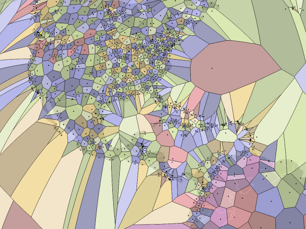
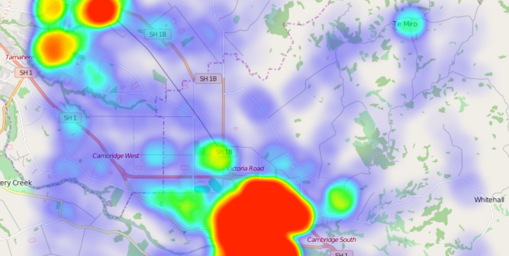

# 지도교실

지도란 무엇일까? 컴퓨터의 도움을 받아 거의 모든 지도를 만드는 지금과는 달리 1980년대까지만 해도 지도 제작은 손이 많이 가는 작업이었다. 오늘날 우리는 처음 가는 곳을 스마트 폰을 이용해 찾아보면서, 뉴스에서 인용되는 데이터 시각화 자료를 보면서, 혹은 국가 경계에 대한 정치적인 논의를 하면서 다양한 방식으로 지도를 활용하고 있다. 이 페이지에서는 지도를 제작하는 입장에서 알아두면 좋을 기본적인 요소들을 훑어보려고 한다.

컴퓨터로 제작된 지도의 근간은 데이터이다. 데이터는 특정한 용도에 국한되지 않으며, 어떠한 형태든 가질 수 있다. 데이터는 점이나 다각형의 형태를 가지고 있을 수도 있고, 혹은 사진과 같은 이미지의 형태일 수도 있다.

데이터에서 추출된 수치, 이미지는 우리가 중요한 결정을 내리는데 도움을 준다. 데이터가 시각적인 형태가 아닌 경우, 어떤 시각적인 요소가 데이터 내 각각의 속성들 잘 타나낼 수 있을 지를 판단하는 상징화를 통해 데이터는 이미지의 형태를 가지게 된다. 사람들은 같은 데이터를 보면서도 서로 다른 질문을 하게 되는데 우리는 데이터를 이리 비틀기도 하고 저리 합치기도 하면서 제각기 다른 질문의 답을 찾고자 노력한다. 데이터를 둘러싼 이러한 일련의 과정은 데이터를 분석하기 위한 것으로 볼 수 있다. 상징화는 우리가 데이터에서 재현할 수 있는 부분에 대한 한계를 생각하게 하고, 데이터 분석은 우리가 방대한 데이터의 어떤 부분을 중심적으로 보아야 하는지에 대한 길을 제시해준다는 점에서 이 두 방법론은 함께 시너지 효과를 낸다.

# 데이터

지리 데이터는 픽셀을 단위로 한 **래스터(raster)** 방식의 데이터와 기하학적인형태를 단위로 하는 **벡터(vector)** 방식이 있다. 이 두 종류의 데이터는 종종 결합되어 사용되는데, 벡터타입의 도로 데이터를 래스터타입의 위성사진 데이터에 올리는 등의 예시를 생각해볼 수 있다.

## 래스터

**래스터** 방식의 데이터는 디지털 카메라로 찍는 사진을 생각해보면 이해하기 쉽다. 단순하게 생각하면, 이렇게 찍힌 사진이란 색깔이 있는 점들의 집합이다. 사진과 같은 래스터 데이터를 크게 확대하고 가까이에서 보면, 픽셀들이 분리되기 시작하는 것이 눈에 띈다.

래스터 데이터는 위성사진과 같은 사진형 데이터에 많이 쓰인다. 하지만 우리가 흔히 보는 사진과 같이 색깔을 가지고 있을 필요는 없다. 각각의 픽셀은 고도나 온도와 같은 숫자 값들을 색상값 대신 가질 수 있고 이런 데이터들도 여전히 래스터 데이터로 분류된다.

##### 래스터 밴드

위의 고도 래스터 데이터에서도 언급했듯이, 래스터 방식의 데이터 내의 픽셀들이 반드시 색상을 값으로 가지고 있는 것은 아니다. 픽셀이 가진 값은 밴드(band)라고 부르는데 보통의 이미지는 빨강, 초록, 파랑 세가지 밴드, 즉 이 세가지 색깔이 합쳐져서 우리에게 익숙한 이미지를 구성다. 고도 데이터는 고도값, 하나의 밴드만 가지고 있는 것처럼 어떤 래스터 데이터는 보통의 이미지보다 적은 수의 밴드를 가지고 있고 또 다른 종류의 래스터 데이터는 우리 눈에 보이지는 않을지언정 셋보다 훨씬 많은 밴드를 가지고 있기도 하다. 래스터 데이터를 분석하고 시각화할 때, 데이터가 가진 여러 밴드 중 어떤 밴드를 사용할지 정하게 된다.

##### 래스터 포맷

래스터 포맷은 데이터를 빠르고 편하게 분석, 전시하는 것을 목표로 한다. [GeoTIFF](http://trac.osgeo.org/geotiff/) 와 JPEG2000와 같이 지리 데이터에 특화되어 있는 래스터 형식도 있다.

래스터 포맷의 파일은 데이터를 픽셀을 기반하여 정리, 가공하고 이 픽셀들이 어떻게 지구위의 장소들을 나타낼 수 있는지에 대한 메타 데이터를 동시에 저장한다.

## 벡터

**벡터** 데이터는 픽셀 데이터가 아닌, 점, 선, 면과 같은 기하학적 모양을 저장하며 오직 필요로 할 때만 시각적으로 전환된다. 그러므로 벡터 데이터를 아주 크게 가까이서 보더라도 픽셀을 볼 일은 없다.

벡터 데이터는 도로, 빌딩, 관심지점(POI, Point Of Interest)과 그 외의 장소 데이터를 저장하기 위해 주로 쓰인다.

##### 벡터 데이터 속성

래스터 데이터의 픽셀은 주로 색깔이나 투명도, 높이와 같은 속성을 가지고 있다. 벡터 데이터는 이보다 훨씬 다양한 속성을 가질 수 있는데, 이를테면 벡터 데이터가 특정 도시 형태의 다각형 정보를 가지고 있다면, 그 지역의 인구, 도시 이름과 같은 글자 데이터, 혹은 이 지역이 특정 국가에 속하는지에 대한 참과 거짓 정보 등 과 같은 여러가지 다른 데이터를 연관지어 저장할 수 있다.

##### 벡터 데이터 포맷

가장 정착된 벡터 데이터 파일 포맷은 [셰이프파일](http://en.wikipedia.org/wiki/Shapefile)이다. 셰이프파일은 데이터를 4 파일들로 분산하여 저장하는데 각각의 파일은  `.shp`(기하학적 도형 데이터가 저장되는 곳), `prj`(사용된 투영법이 문자열 형태로 저장되는 곳), `shx` (검색을 빠르게 하기 위한 색인 숫자가 저장되는 곳), `dbf` (`.shp` 파일과 연관된 모든 데이터들이 저장되어있는 데이터베이스)와 같다. 대부분의 파일들은 바이너리 형태의 데이터이므로 `.prj` 파일을 제외한 파일들을 텍스트 에디터에서 연다고 해도 인간의 눈에 유의미한 무언가를 확인할 수 없다. `.dbf`형식의 파일은 오래된 데이터 베이스 사양을 따르고 있어 `.dbf` 파일에 저장될 수 있는 연관 데이터의 용량을 2GB로 제한되며, 필드 네임은 10자(characters)를 넘을 수 없고 띄어쓰기 및 특수문자를 포함할 수 없는 등의 다양한 한계를 가지고 있다. (더 자세한 한도는 [이 곳](http://en.wikipedia.org/wiki/Shapefile#Limitations)에서 확인할 수 있다.) `.dvf`파일은 LibreOffice Calc를 통 열 수 있다.

[지오제이선(GeoJSON)](http://geojson.org/)과 [토포제이선(topojson)](https://github.com/mbostock/topojson), [케이엠엘(KML)](http://developers.google.com/kml)은 각각 [제이선(JSON)](http://www.json.org/)형식과 [XML](http://en.wikipedia.org/wiki/XML)을 기반으로 한 비교적 새로운 지리 데이터 포맷이다. 이 새로운 파일 형식들은 바이너리가 아닌 사람이 읽을 수 있는 형태의 문자열로 이루어져있으며, 셰이프파일보다 소프트웨어에서 호환되기 쉬운 점 등의 장점을 가지고 있어 웹 소프트웨어의 새로운 기준점이 되어가고 있다. 지오제이선의 단점이라면 각각의 레코드 내에서 속성을 뽑아 비교하는 점이 어려운 점을 들 수 있으며 이 때문에 데이터를 원하는 형태로 변형하거나 분석하는 것이 어려울 수 있다.

### 토폴로지 (Topology)

어떤 벡터 데이터는 토폴로지, 각 형태들 간의 관계들을 저장하기도 한다. 광명시와 서울시처럼 서로를 맞대고 있는 행정구역을 생각해보자. 어떤 데이터는 광명시를 나타내는 모양과 서울을 나타내는 모양을 따로 따로 저장하여 둘 사이의 맞닿는 경계를 겹치게 놓을 것이다.

만약 우리가 어떤 행정구역들이 서로 경계를 맞대고 있는지 알아내고 싶거나, 각각의 행정구역 모양을 단순하게 만들고 싶은데 서로 맞닿는 경계는 보존하고 싶다면 이렇게 따로 저장된 데이터는 골치가 될 수 있다. 토폴로지는 이런 때 유용하게 이용될 수 있는데, 어떤 벡터 데이터는 광명시와 서울의 모양을 각각 저장하는 대신 많은 선들을 저장하고 이 선들 중 어떤 부분이 경계 부분에 해당하는지 저장해둔다. 이런 방식으로 저장되어 있다면  광명시와 서울 사이의 경계가 수정될 경우 경계 변화가 일으킨 두 시의 형태 변화도 쉽게 저장할 수 있다.

## 지오코딩

장소 이름, 도로명, 주소와 같이 벡터나 래스터 형태가 아닌 텍스트를 기반으로 하는 데이터도 있다.

안타깝게도 이런 데이터들을 바로 지도 위에 올려놓는 것은 여러모로 어려운 일이다. 그래서 이런 데이터를 위도와 경도로 바꾸는 작업을 하게 되는데 바로 이 과정을 우리는 **지오코딩**이라고 부른다. 지오코딩은 도로명, 국가 이름 등등의 데이터와 다른 지리적인 위치 데이터들과 합쳐진 데이터를 필요로 하며 정확하지 못할 가능성이 높은 인풋을 데이터 베이스 내의 데이터와 매칭하는 알고리즘을 필요로 한다.

### 역지오코딩

위에서 언급된 과정의 반대 과정을 **역지오코딩**이라고 한다. 역지오코딩은 점과 같은 지리적 데이터를 읽을 수 있는 문자, 이를테면 '한국'이라든가 '14번가 1714번지'와 같은 문자열로 바꾸어준다. 지구 위의 장소들이란 으레 서로 겹치고 복잡한 경계 사이에 있기 마련이라 보통의 지오코딩처럼 역지오코딩이 아주 정확한 과정을 거친다고 보기엔 어렵다.

지오코딩과 역지오코딩은 어렵다. 좌표상의 위치 에러도 있고, 주소 데이터가 제대로 포맷되지 않은 경우도 있으며 계속해서 변하는 도로의 형태와 빌딩들은 주소 데이터를 좌표로 바꾸는 과정을 더 어렵게 만든다.

<a class='further-reading' href='/geocoding.kr.html'>지오코딩에 대해서 더 읽어봅시다.</a>

## 데이터 수집

선원들이 남긴 항해일지에서부터 트위터까지, 지도 데이터를 수집할 수 있는 방법은 엄청 많다. 언급할만한 가치가 있는 메이저 데이터 소스들은 다음과 같다.

스마트폰에서 지도앱을 사용하면서 자신의 위치를 확인하는 일은 누구나 한번 쯤 해보았을 것이다. 이 기능을 위해 이용하는 **지피에스(GPS)**는 인공위성으로부터 수신하는 데이터이고, 정확한 벡터 데이터 수집을 위한 기본이 된다. 데이터 측량가는 정확한 GPS기기를 가지고 이동하면서 GPS데이터를 모으고, 이 데이터들을 다른 데이터 소스들과 결합한다.

**관측 위성과 비행기**는 다른 고도에서 계속해서 위성사진을 찍으면서 오늘날 널리 쓰이는 래스터 데이터를 모은다. 이 때 사진을 위해 쓰이는 적외선과 같은 센서들은 비가시광선 데이터도 수집하는데 이 데이터는 농경지대나 삼림벌채지대 등을 맵핑할 때 유용하게 쓰인다. 여기에서 파생된 [라이다(LiDAR)](http://en.wikipedia.org/wiki/Lidar)와 같은 기술에 쓰이는 레이저 센서는 래스터 고도 데이터를 수집하는데 활용된다.

**기업, 정부, 커뮤니티**는 각자의 필요를 기반으로 결정한 수준의 상세 지도를 유지 관리한다. 이를테면 구글이나 오픈스트릿맵은 도로에 대한 데이터를 세밀하게 맵핑하는 것을 목표로하지만 씨아이에이 월드 팩터북(CIA World factor book)이나 네츄럴 얼쓰(Natural Earth)같은 곳은 정치적인 국경을 기록하는데 중점을 둔다.

### 저장

지리적인 데이터를 저장하는데 여러가지 방법이 있다. 이전에는 데이터를 출력하여 저장하는 방법이 흔하게 통용되었으나, 요즘 들어서는 빠르고 쉽게 접근, 공유할 수 있는 웹을 이용한 방법이 보편화되고 있다.

지리 데이터를 저장하기 위한 여러가지 파일 형식과 관례가 있고 이에 따라 쓰이는 도구도 다 제각각이다. 데이터는 데이터베이스나 개별 파일로 저장되지만 그 차이점은 그닥 중요하지 않다.

# 정보

지도는 시각화된 정보라고 볼 수 있다. 물론 그 뒤에는 데이터, 숫자, 저장 등 여러 방법을 동원하여 지구 내의 위치 데이터를 기록하려는 노력이 존재하지만 말이다. 이 데이터를 시각화로 옮길 때 우리는 필연적으로 동그란 지구 위를 납작한 종이나 컴퓨터 스크린으로 전환하기 위한 투영법의 문제를 마주하게 된다. 색상, 톤, 심볼 등 지도를 위한시각화의 구체적인 상징은 사람들이 이해하고 분석할 수 있는 방향으로 정해져야 한다.

## 경도와 위도

지구 위의 장소를 나타내는 가장 일반적인 바법은 경도와 위도를 사용하는 것이다. 역사적으로 경도와 위도는 `38° 12'`와 같이 육십진수를 사용하여 기록되었다. 하지만 최근 `38.2`와 같은 단순 숫자로 경도와 위도를 나타내는 방법이 제시되었고 이 편이 컴퓨터를 이용해 경도, 위도를 사용할 때 더 편리하다.

**위도** 값은 -90에서부터 90(남극, 북극) 사이에 존재한다. 적도의 위도 값은 0이다.

**경도** 값은 -180에서부터 180까지 존재한다. 선이 서로 만나는 곳, 태평양의 남쪽과 북쪽을 가르는 선은 날짜변경선이라고 부른다. 경도 값이 0인 곳은 자오선이라고 부르며 아프리카 대륙과 유럽을 가른다(구체적으론 런던 그리니치에 있는 로얄 천문대를 지나간다.)

경도와 위도를 합쳐 좌표라고 부르고 '경도, 위도' 혹은 '위도, 경도'의 형태로 나타낸다. 오랜동안 위도를 먼저 표현하는 방법이 더 많이 사용되었으나 경도를 먼저 나타내는 방법이 유클리드 공간의 좌표체계 (x,y)와 닮은 까닭에 최근 대두되었다.

브라우저를 바탕으로 한 소프트웨어들이 경도와 위도 중 어떤 것을 먼저 둘지에 대한 합의점을 찾지 못했기 때문에 좌표 순서는 가끔 혼란을 불러일으킨다.

가끔은 경도와 위도 외의 다른 데이터들이 같이 저장되기도 한다. 고도 데이터가 대표적인 예이며 데이터가 수집된 시간도 이 번외 데이터의 한 예가 될 수 있다. 데이터에 고도가 포함되는 경우엔 '경도, 위도, 고도'와 같이 보통 고도 데이터를 가장 마지막에 저장한다.

## 지구의 모양

경도와 위도는 지구라는 구 위의 좌표를 정확하게 나타내고 있는 걸까?

지구는 자전하고, 이에 따라 형태가 약간씩 변하면서 지구는 구라기보다 납작한 회전 타원체 형태라고 볼 수 있다. 더 엄밀하게 이야기 하자면 사실 지구는 산, 강 도시 등으로 뒤덮여 있어서 매끄러운 회전타원체라고 보기도 어렵다.

우리는 이 정의 내리기 어려운 모양새에 대해 다른 추정을 사용한다 : WG84와 같은 스탠더드는 지구의 양 축에 대해 정확한 길이를 정의해서 우리가 지구를 구 형태보다 참조타원체로 볼 수 있도록 도와준다. 지역 측정이나 정확한 표면적 값을 요구하는 과학 분야는 이론적인 해수면 높이를 삼차원 적으로 계산한 지오이드(geoid) 모델을 사용하기도 한다.

지구를 측정하고 계량할 수 있는 기술은 빠르게 발전하고, 지구의 모양도 계속해서 바뀜에 따라 지구의 형태 측정과 관련된 문제에 집중하는 지구과학의 분과인 축지학은 인류에게 영원한 숙제이다.

## 투영법

투영법은 동그란 지구 위의 좌표를 컴퓨터 모니터나 종이와 같은 평면에 나타낼 수 있도록 전환해주는 수학적 방정식을 일컫는다. 모양을 일그러트리지 않고 동그란 지구를 평면에 나타낼 수 있는 방법은 사실상 없다. 투영 과정에서 우리는 방향이나 상대적인 크기를 잃는 경우도 잇고, 혹은 이상하게 생긴 모양을 얻게 되는 경우도 잇다.

<a class='further-reading' href='/datum.kr.html'>축지계에 대해서 더 읽어봅시다.</a>

<a class='further-reading' href='/projections.kr.html'>투영법에 대해서 더 읽어봅시다.</a>

## 상징화

지도 제작에서 상징화는 데이터들이 지도위의 시각적인 요소가 되어가는 과정을 일컫는 말이다.

데이터는 본래 어떤 모양도 가지고 있지 않은 경우가 많다. 지도에 그려져있는 도로 데이터를 엑셀 스프레드 시트나 차트로 옮긴다고 해도 데이터는 그 값을 잃지 않는다. 이러한 데이터의 특징을 생각했을 때, 데이터 상징화는 데이터를 '변환'한다기 보다는 데이터를 어떻게 나타내느냐 (렌더링하느냐)의 문제라고 볼 수 있다.

상징화 테크닉은 쓰리디를 포함한 그래픽으로 나타낼 수 있는 모든 것을 포함한다. 몇 가지 예를 살펴보자.

### 순차형, 범주형

상징화는 데이터의 순차적인 면과 범주적인 면, 두가지 특성을 강조하는 경향이 있다. 순차적, 혹은 계속적인 데이터는 선형 데이터라고 불리기도 하는데 졸업률과 같이 특정한 범위 내에 있는 숫자 값의 집합인 경우가 많다. 범주형 혹은 개별 데이터의 경우 값이 어떤 범위에 분포되어있기 보다는 참, 거짓 혹은 민주당, 공화당 처럼 양가적이다.

데이터 사이의 구분은 상징화를 위한 주요 관심사가 된다. 순차형 데이터 소스는 점의 조밀도나 서서히 변하는 색상도와 같은 표현 방법이 어울릴테고, 범주형 데이터는 주로 여러 심볼, 마커나 고유 색상을 통해 표현된다.

### 등치지역도 (Choropleth)

등치지역도는 지역의 모양, 존재하는 경계선들을 보존하고 경계 안의지 색상 혹은 무늬를 바꾸면서 데이터를 표현한다. 인구지도나 선거 결과와 같이 데이터가 정해진 값의 퍼센트를 가지는 경우를 나타낸 지도들이 등치 지역도의 쉬운 예이다.

등치지역도는 비율, 밀집도, 혹은 퍼센트를 나타내는데 적합하다. 하지만 등치지역도는 지역의 지리적인 경계를 지키기 때문에 큰 지형의 값을 과장하는 경향이 있다. 또한 등치 지역도는 색상이나 무늬의 차이를 이용해서 정보를 표현하기 때문에 색맹인 사람들이 인식 가능한 색인지, 이해가 쉽게 가고 일관성있는 색상을 선택하는 것이 중요하다.

<a class='further-reading' href='/colors.kr.html'>색상에 대해서 더 읽어봅시다.</a>

### 점 지도

절대값을 나타내야한다면 등치지역보다 점 지도가 더 나은 선택일 수 있다. 점 지도는 지형에서의 한 점만 활용하기 때문이다.

점이나 마커 등이 주로  지도에 활용되는데, 구체적인 스타일은 지도의 용도에 따라 크게 바뀔 수 있다. 점을 순차적인 값이나 범주의 값에 따라 색칠하는 것도 한 방법이겠지만, 더 나아가서 한 점을 서로 다른 크기로 확대하여 이것들의 상대적인 값을 보여줄 수도 있다. 이 때 이용되는 심볼은 동그라미, 네모 등의 모양, 혹은 심볼이 나타내고자 하는 이미지 자체가 될 수도 있다. 만약 포인트 맵에서 여러가지 변수를 같이 봐야 할 때 크기가 서로 다른 파이차트를 통해 다른 변수를 나타낸다면 복잡한 데이터 셋을 좀 더 쉽게 나타낼 수 있을 것이다.

한 가지 주의해야할 점은 너무 많은 데이터 포인트를 한 번에 보여주려고 하면 안된다는 것이다. 너무 많은 포인트가 모여있는 지도는 읽기 어려울 확률이 높기 떄문이다. 데이터 포인트가 실제로 많은 경우라면, 값들을 합쳐 평균을 내어 등치 지역도를 만드는 것도 고려해볼만한 선택사항이다. 지도가 가까이 확대될 때 까지 값들을 군집화해서(clustring) 보여주는 것도 다른 선택사항이 될 수 있다.

## 게시하기

## 분석하기

래스터와 벡터 데이터 분석은 통합 및 변환 과정이라고 볼 수 있다.

### 벡터에서 래스터로

벡터와 레스터, 두 종류의 지도 데이터는 공통점이 없어 보이지만 서로의 형태로 전환하는 일은 빈번하게 일어난다. 하지만 약간의 과정을 거쳐야 한다.

벡터 데이터는 사실 언제나 래스터 데이터화 되고 있다. 벡터 데이터를 픽셀 값으로 바꾸어 보여주는 것, 이 과정에서 벡터데이터는 ‘래스터화' 되거나 ‘렌더'된다. 컴퓨터 스크린이나 프린터는 픽셀레벨에서 작동하기 떄문이다. 래스터로의 변환 과정에서 벡터 데이터는 아무리 확대해도 데이터가 열화되지 않는 벡터 데이터의 장점을 잃어 버리게 된다. 또한, 일반적으로 한 번 벡터 데이터가 래스터로 데이터 변환 과정을 거치면 다시 소스 벡터데이터로 완벽하게 복구하는 것은 어려운 일이다.

데이터를 분석하기 위해서 벡터 데이터를 사전에 래스터로 바꾸기도 한다. 수식을 연산해내기에는 픽셀을 기반으로 한 데이터가 더 용이하기 떄문이다.

### 래스터에서 벡터로

마찬가지로 래스터 데이터도 여러가지 경로를 통해 벡터 데이터화 될 수 있다. 래스터 데이터인 지구의 위성사진을 보고 사람들은 그 위에 도로를 뜻하는 선, 집을 뜻하는 점, 빌딩을 나타내는 다각형들을 그린다. 이러한 방법을 통해 전환된 데이터들은 우리가 지도로 더 많은 일을 할 수 있도록 도와준다. 이를테면 도로가 벡터 데이터를 가지고 있다면 이 데이터를 바탕으로 길찾기를 할 수 있지만 위성사진으로는 이런 일을 할 수 없다.

### 시뮬레이션 (Simulation)

지리 데이터와 함께라면 어떤 현상을 시뮬레이션하는 것이 가능하다. 그리고 사실 이것은 지도제작자들의 주요 업무 중 하나이기도 하다. 이를테면 한 산맥의 고도데이터가 있다면 어떤 부분이 빛을 많이 받고 어떤 부분이 그늘이 지는지를 시뮬레이션 해볼 수 있을테고, 이러한 시뮬레이션 과정을 힐셰이딩(hillshading)이라고 한다.

### 집합 (Aggregation)

가장 흔하게 쓰이는 집합화의 전략은 총합을 구하는 것이다. 많은 숫자들이 있다면 이 숫자들이 얼추 어떻게 이루어졌는지 한 눈에 파악하기 위해서 모두 더하는 것이다. 국가별 국내 총생산(GDP)를 보여주는 것은 해당 국가 내 개개인의 소득을 목록화해서 보여주는 것보다 훨씬 빠르게 정보를 전달할 수 있는 것처럼 말이다.

지도 내에서의 집합화도 비슷하게 쓰인다. 세분화된 데이터가 있을 때, 이를테면 몇십만 가구의 소득 데이터가 있다고 해보자. 맵핑 알고리즘을 써서 해당 지역의 데이터 값들을 합하거나 합한 값의 평균을 구할 수 있을 것이다.

집합화는 **비닝(binning)**이라고 불리는 테크닉과 함께 쓰일 수 있다. 비닝이란 개별의 데이터 포인트가 있을 떄, 지도 위에 육각형이나 사각형과 같은 임의의 모양으로 격자를 그리고 이 격자에 각각의 포인터가 맞물릴 수 있도록 하는 것이다. 비을 이용하면 한 눈에 알아보기 어려운 수 없이 많은 점 데이터 대신 등치지역도를 얻을 수 있다.

### 보간(Interpolation)

집합화가 많은 데이터 포인트를 분석하고 시각화하기 적합하도록 데즈이터를 처리하는 방법이라면 보간법은 집합화와는 반대로 값 사이의 빈 부분을 채우는 방법이다. 보간법은 보통 고도 데이터 (래스터 데이터, 산 높이를 인치별로 나누어 고도 데이터로 저장하지만 중간 중간 빈 부분이 생긴다. 이와 같이 빈 값을 프로그래머들은 null값이라고 부른다.)와 같은 데이터에 쓰인다.

보간법은 빈 부분 주변부의 값들을 살펴보고 누락된 값은 이 주변부 값과 비슷할 것이라고 가정한다. 고도 데이터에 빗대어 생각해보자면 산 정상 부분에서 누락된 값은 분명 꽤 높을 것이고 계곡에 주변의 누락된 값이라면 꽤 낮을 것이다.

포인트 데이터를 보간하는 방법에는 여러가지 방법이 있다.

**보로노이 다이어그램**은 흩어져있는 점들을 주변의 공간을 완전히 사용하여 다면체로 전환할 수 있도록 해준다. [공항 위치를 이용해 보노로이 다이어그램을 그린 좋은 예시가 있다.](https://www.jasondavies.com/maps/voronoi/airports/)

**열지도**는 각각의 데이터 포인트에 가중치를 부여하고 데이터 포인트의 조밀도를 더 ‘뜨거운' 색상을 이용해서 표현한다. [리플렛 힛트 플러그인](https://github.com/Leaflet/Leaflet.heat)은 열지도의 좋은 예를 보여준다.

- **등치선(Contour Lines)**은 샘플 데이터의 포인트를 가지고 주변의 값을 예측하여 계속적인 선으로 그린 것이다.
- **불규칭 삼각망(TIN, Triangulated Irregular Network)** 포인트 사이의 삼각형을 그려서 지형(terrain)을 시각화할 수 있도록 해준다.

## 나가며

지도는 수학, 물리학, 환경학, 예술 등의 다양한 주제로 확장되어 논의될 수 있는 흥미로운 분야이기도 하지만 여전히 해결하지 못한 숙제가 많은 분야이기도 하다. 본 페이지가 많은 사람들에게 유익했기를 바란다.

지도 교실 내용에 대한 제안이 있다면 [이 쪽](https://tmcw.wufoo.com/forms/mapschool-feedback/)으로 의견 주세요.

### 라이센스

[크리에이티브 커먼 제로](http://creativecommons.org/publicdomain/zero/1.0/)
